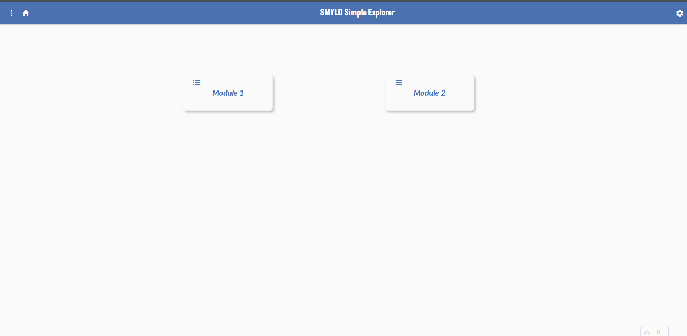
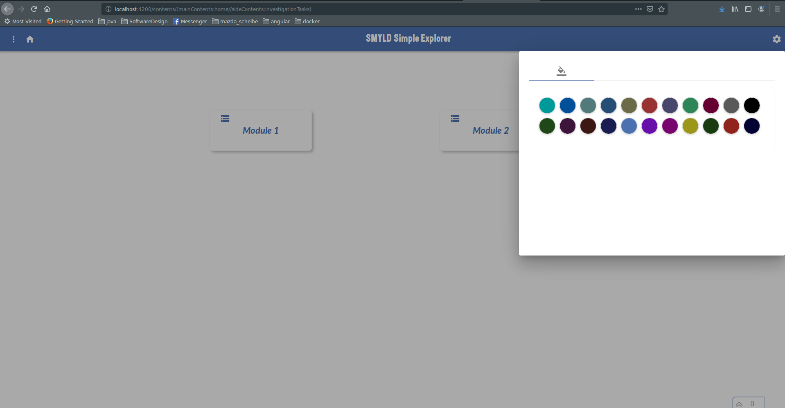

# Angular Simple Explorer template

The Simple Explorer Template is created using Angular 8 and Angular Material library. 

This template can be used by developers to speed up creating a new project. The template looks like below:

What is actually shown are two place holder modules "Module1" and "Module2", they will be included in the template source code as a guid for the developer on how to integrate thier own modules inside the template.

## Features List

### Simple Theme 

By selecting the settings as shown below:

the theme color can be updated, although this looks simple but it updates angular material components themsevles to reflect the newly selected color.

