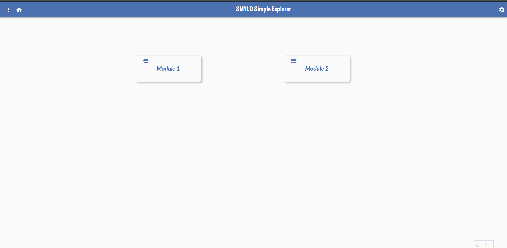
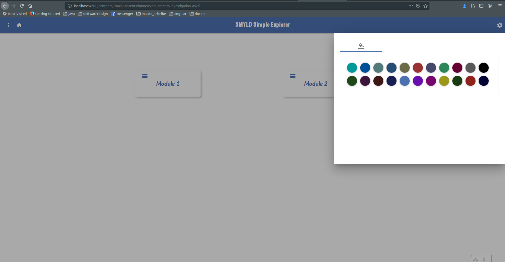
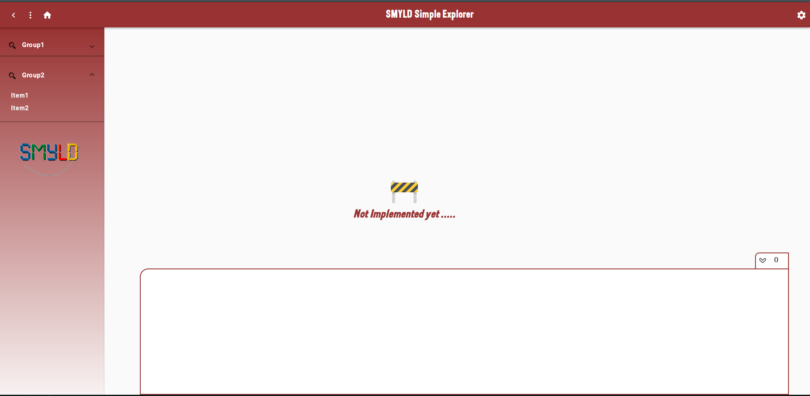

# Angular Simple Explorer template


The Simple Explorer Template is created using Angular 8 and Angular Material library. 

This template can be used by developers to speed up creating a new project. The template looks like below:




What is actually shown are two place holder modules "Module1" and "Module2", they will be included in the template source code as a guid for the developer on how to integrate thier own modules inside the template.

## Features List

### Simple Theme 

By selecting the settings as shown below:



the theme color can be updated, although this looks simple but it updates angular material components themsevles to reflect the newly selected color.



### Messages Panel

The template includes a messages panel that shows the different logging messages categorized as (INFO, ERROR and WARNING), each will be displayed with a proper icon. The messages panel is shown at the bottom of the screen and with hovering the mouse over it, will fade in and slide upwards to show the messages, upon another hovering of the mouse the panel will go back to its place.


[ >>>> Go To Show Case <<<< ](https://www.youtube.com/watch?v=aaCTbyGFfxE&feature=youtu.be)


### Developer's question : How to use it?


#### 1 - Downloading the template
Since Github does not support the direct download of a specific folder in the repository but provides the clone for the whole repository, we can not download this template without cloning the whole respository which is not unwieldy. 
However there are several ways to get around that, as shown below:

##### via Subversion!
Yes! via Subversion this is possible, just run the following command below:
``` bash
svn co https://github.com/MFJamil/smyld/trunk/angular/templates/SMYLDSimpleExplorer
```
_Requires having subversion installed_
##### via Codeload!
Another way of filtering out the repository via the codeload link, just run the following command below:
``` bash
curl https://codeload.github.com/mfjamil/smyld/tar.gz/master | tar -xz --strip=3 smyld-master/angular/templates/SMYLDSimpleExplorer
```

_Requires having curl and tar installed_
#### 2 - Building the template
To build the template you need to issue the npm command below from inside the template folder:
``` bash
npm install
```

_Requires having npm installed_
#### 3 - Running the template
To run the template you need to issue the command below from inside the template folder:
``` bash
ng serve
```

_Requires having angular client installed, preferably version 8_

#### 4 - Testing the template
To test the template you need to open the browser and type "localhost:4200"

#### 5 - Start coding
In order to start coding your module to use the template, there are an already two place holder modules inside the code, that you can use as a sample for how to integrate your work. After opening the template with your preferred editor (I do use Visual Code), the source code is divided in a clear way to show where to integrate the code, the usual folder that hosts the source code is "src/app", the place holder modules are defined under a folder called "modules", so the path to the modules is "src/app/modules". You will notice that each module contains two subfolers hosting the two different components for each module, one is called "container" and the other one is called "explorer", the Container component is to be placed in the main page while the explorer will be placed on the left, see the source folder contents shown below: 

``` diff
.
├── app.component.css
├── app.component.css.map
├── app.component.html
├── app.component.sass
├── app.component.spec.ts
├── app.component.ts
├── app.module.ts
├── app-routing.module.ts
├── main
│   ├── components
│   │   ├── contents
│   │   │   ├── contents.component.css
│   │   │   ├── contents.component.css.map
│   │   │   ├── contents.component.html
│   │   │   ├── contents.component.sass
│   │   │   ├── contents.component.spec.ts
│   │   │   └── contents.component.ts
│   │   ├── header
│   │   │   ├── header.component.css
│   │   │   ├── header.component.css.map
│   │   │   ├── header.component.html
│   │   │   ├── header.component.sass
│   │   │   ├── header.component.spec.ts
│   │   │   └── header.component.ts
│   │   ├── home-page
│   │   │   ├── home-page.component.html
│   │   │   ├── home-page.component.sass
│   │   │   ├── home-page.component.spec.ts
│   │   │   └── home-page.component.ts
│   │   ├── messages-panel
│   │   │   ├── messages-panel.component.html
│   │   │   ├── messages-panel.component.sass
│   │   │   ├── messages-panel.component.spec.ts
│   │   │   └── messages-panel.component.ts
│   │   └── settings
│   │       ├── settings.component.html
│   │       ├── settings.component.sass
│   │       ├── settings.component.spec.ts
│   │       └── settings.component.ts
│   ├── contents-routing.module.ts
│   ├── model
│   │   └── Module.ts
│   ├── services
│   │   ├── message.service.spec.ts
│   │   ├── message.service.ts
│   │   ├── side-nav.service.spec.ts
│   │   └── side-nav.service.ts
│   └── services.enum.ts
├── message.ts
├── modules
│   ├── module1
│   │   └── components
│   │       ├── container
│   │       │   ├── module1-container.component.html
│   │       │   ├── module1-container.component.sass
│   │       │   ├── module1-container.component.spec.ts
│   │       │   └── module1-container.component.ts
│   │       └── explorer
│   │           ├── moduel1-explorer.component.spec.ts
│   │           ├── module1-explorer.component.html
│   │           ├── module1-explorer.component.sass
│   │           └── module1-explorer.component.ts
│   └── module2
│       └── components
│           ├── container
│           │   ├── module2-container.component.html
│           │   ├── module2-container.component.sass
│           │   ├── module2-container.component.spec.ts
│           │   └── module2-container.component.ts
│           └── explorer
│               ├── module2-explorer.component.html
│               ├── module2-explorer.component.sass
│               ├── module2-explorer.component.spec.ts
│               └── module2-explorer.component.ts
└── utils
    ├── dnd
    │   ├── dnd.directive.spec.ts
    │   ├── dnd.directive.ts
    │   └── DndFilesListener.ts
    ├── logMessage.ts
    ├── LogUtils.ts
    └── RoutingUtils.ts

```

**However, the components will not be automatically placed like this!**

The above structure of folders for the modules as well as the naming of components was only for having a clean structure to speed up onboarding process for the developers, nevertheless the real integration of the modules that will be handled by the template can be found on "src/app/main/model/Module.ts" file.
  Below is the complete source code of this module that is basically holding all the modules declaration:
  

```typescript
import { Module1ContainerComponent } from '../../modules/module1/components/container/module1-container.component';
import { Module1ExplorerComponent } from '../../modules/module1/components/explorer/module1-explorer.component';
import { Module2ContainerComponent } from '../../modules/module2/components/container/module2-container.component';
import { Module2ExplorerComponent } from '../../modules/module2/components/explorer/module2-explorer.component';


export class Module {
    name: string;
    path: string;
    mainComponent: any;
    sideComponent: any;
}

export const modules: Module[]=[
    {
        name:'Module 1',
        path:'openModule1',
        mainComponent: <any>Module1ContainerComponent,
        sideComponent: <any>Module1ExplorerComponent

    },
    {
        name: 'Module 2',
        path: 'openModule2',
        mainComponent: <any>Module2ContainerComponent,
        sideComponent: <any>Module2ExplorerComponent

    }

];
```
The code is self explanatory about what each field is pointing to.


_**To be Continued**_
