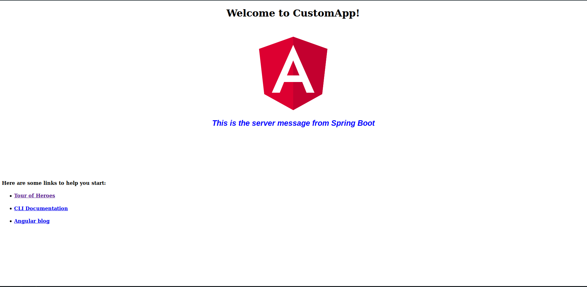
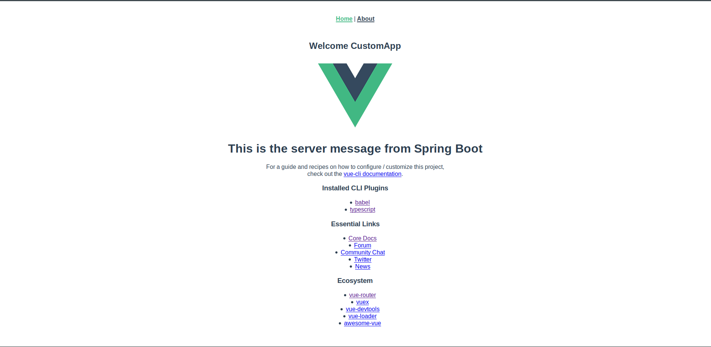
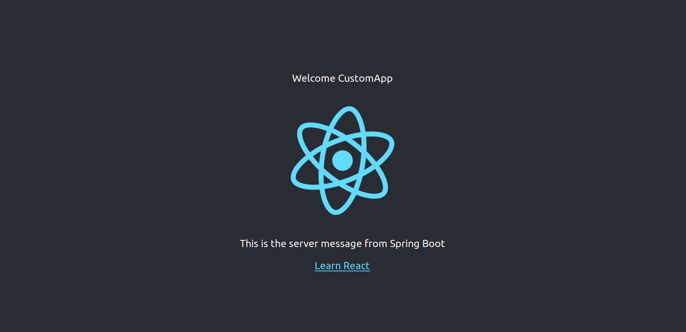

# Spring Generator

This python program generates a maven based full interactive project that includes Spring Boot in the backend and one of the web based frameworks (Angular, Vue or React) in the frontend, the generated project will include an already exchanged message with the backend that will get displayed on the frontend startup page.

---
### Usage

usage: springGenerator.py [-h] [-t {angular,vue,react}] -n NAME -g GROUP
                          [-s SERVERPORT] [-c CLIENTPORT] [-d DIR]


  * -t : to specify the type of the web based framework, default is Angular, the values that can be supplied are mentioned in the help command line above.
  * -n : the name of the generated project
  * -g : the group, usually it will be the package name that the generated project will hold.
  * -s : the server port number, this will be the entry port number that the backend system will open, running the final project after deployment will address this port number (default is 8090)
  * -c : the client port number, this is the port number that can be used in development mode, default is 4200.
  * -d : the generated project main path, default path is the current active directory that this python program is invoked at.    
  
 ---
 
 _IMPORTANT: This program is only tested under linux systems so far_ 
 
 ---
 
### Examples
 
 Issuing the following command will create a project called 'CustomApp' with a group/package 'com.smyld.app', setting the port number to  8091 and the angular front end development port to 4500
 
 ```bash
 springGenerator.py -t angular -n CustomApp -g com.smyld.app -s 8091 -c 4500
 ```
 
 You need to run a normal maven build command from within the generated folder to build the backend and frontend projects.
 
 Upon opening the projects with your favorite editor, you can see the line below :
 ```typescript
 this.http.get<Message>("/api").subscribe(servMessage => this.serverMessage = servMessage.text);
 ```
 inside the app.component.ts file. The frontend is sending a message request from the backend, on the backend project, you will find where this message is processed, see the line below:
 
 ```java
 	@GetMapping
	public Message getServerMessage(){
		return new Message("This is the server message from Spring Boot");
	}
```

The resultant startup page will display the message out of the code snippet above can be seen below:



Similarly issuing the same command for Vue framework will create the page as seen below:

and below how the startup page for React will look like:



The same applies for the other two frameworks (i.e. React and Vue), however the APIs used will be different.
_It is important to note that the generated frontends are all written in Typescript!_
 
---

## Contributors notice
Feel free to extend the generator. The python functionality allow you to template the created folders, the created file name as well as the created file contents. Take a look at the already available templates to have an idea on how it is created.


## Running as docker [](https://hub.docker.com/r/smyld/tools_build)
The program is available on dockerhub under the following url: [Spring Generator at Docker hub](https://hub.docker.com/r/smyld/tools_build). For developers who are currently using docker at their machines, you can run the docker image as following:

```shell
docker run --user $(id -u):$(id -g) -v [Your projects path]:/project smyld/tools_build:spring_generator -n [ProjectName] -g [GroupName] [-t {angular,vue,react}] [-s] [-c]
```


You need to pay a special care for the command arguments above, you need to only replace the values inside the big brackets with what you need. The command above will create Angular as a frontend and will place the created project folder in the given path. 
  * --user if the user parameter is not provided, the project will be created with root rights and that will cause the developer to always supply the command as the root and this will affect the building of the project. This is due to the fact that the docker will be installed only as a root. No need to update or change the argument value '$(id -u):$(id -g)', as this will make use of "id" program to fetch the current user credential.
  * -v this argument will link the host path (your local path) to the path of the container, you can pick the path you want on your machine, however, ":/project" should remain the same, since the container will write the created project to that path inside of the container which will be updating the given host path automatically.
  * smyld/tools_build:spring_generator is the container's address.
  * The rest of arguments are the same defined for this script except the argument "d" which is removed, since the path is already specified via the "v" argument already.

### Example
```shell
docker run --user $(id -u):$(id -g) -v ~/Documents/temp:/project smyld/tools_build:spring_generator -n AngCutomer -g com.smyld.apps
```
The command above will create Angular frontend project with the name "AngCustomer" that will be placed under "Documents/temp" folder as a folder named "AngCustomer" and will be referenced in Spring Boot with the package "com.smyld.apps".


## Downloading the script
Since Github does not support the direct download of a specific folder in the repository but provides the clone for the whole repository, we can not download this template without cloning the whole respository which is not unwieldy. 
However there are several ways to get around that, as shown below:

##### via Subversion!
Yes! via Subversion this is possible, just run the following command below:
``` bash
svn co https://github.com/MFJamil/smyld/trunk/tools/build/spring_generator
```
_Requires having subversion installed_
##### via Codeload!
Another way of filtering out the repository via the codeload link, just run the following command below:
``` bash
curl https://codeload.github.com/mfjamil/smyld/tar.gz/master | tar -xz --strip=3 smyld-master/tools/build/spring_generator
```

_Requires having curl and tar installed_
